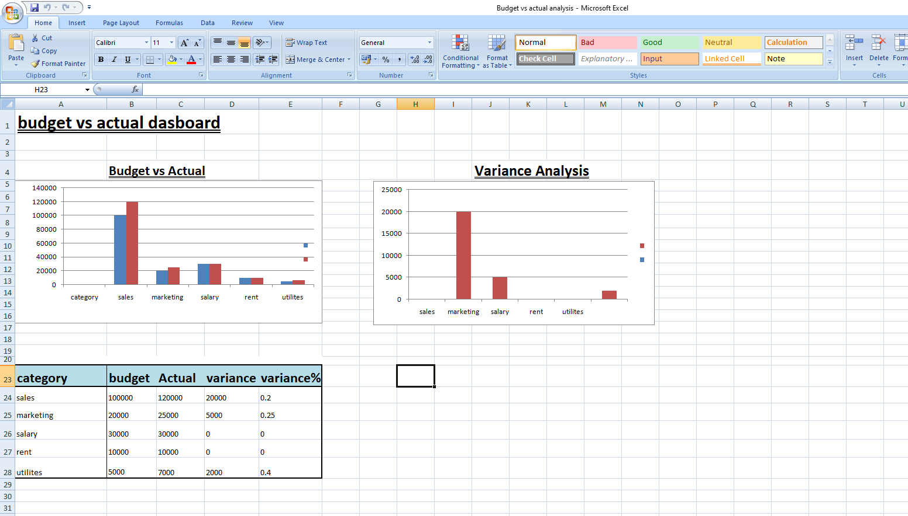

# 📊 Budget vs Actual Dashboard

## 📌 Overview

This project is a financial dashboard created using Microsoft Excel to compare budgeted and actual performance. It helps analyze variances and supports better business decision-making.

---

## 🎯 Objective

To evaluate financial performance by comparing planned (budget) values with actual results and identifying variances.

---

## 🧮 Key Concepts Used

* Variance Analysis
* Budgeting & Forecasting
* Performance Evaluation

---

## 🛠️ Tools Used

* Microsoft Excel

---

## 📊 Dashboard Components

* **Bar Chart**: Comparison of Budget vs Actual
* **Column Chart**: Variance Analysis
* **Data Table**: Detailed financial data with calculations

---
## 📸 Dashboard Preview

 

## 📈 How It Works

1. Enter budgeted and actual values for each category
2. The model calculates variance and percentage variance
3. Charts visually represent performance differences
4. Helps identify overperformance and underperformance

---

## 📊 Output

* Variance (Actual − Budget)
* Variance %
* Visual insights through charts

---

## 🚀 Learning Outcome

This project demonstrates practical application of management accounting concepts and enhances skills in financial analysis and dashboard creation.

---

## 👤 Author

**Bhuvan Sharma**
US CMA Candidate
